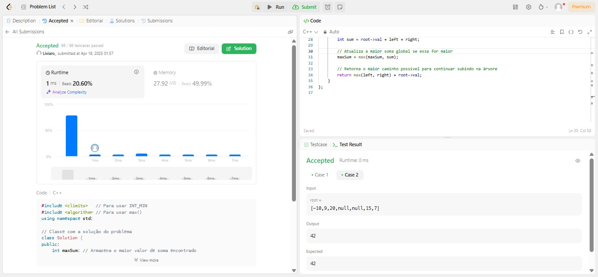

# Grafos1_leetcode_judge

**Número da Lista**:  
**Conteúdo da Disciplina**: Grafos1 

## Alunos
|Matrícula | Aluno |
| -- | -- |
| 20/0067036  |  Leonardo Fernandes Padre |
| 18/0105051  |  Lívia Rodrigues Reis |

## Sobre 
Repositório com resoluções de problemas de grafos do [LeetCode](https://leetcode.com/).

## Apresentação 

## Screenshots

### Exercício - 124. Binary Tree Maximum Path Sum

Dificuldade: Difício  
Link: [Clone Graph](https://leetcode.com/problems/binary-tree-maximum-path-sum/description/) 
Solução: [Código](exercises_leetcode/124_hard/124_binaryTreeMaximumPathSum.cpp) 
Para resolver esse exercício foi utilizada a busca em profundidade (DFS) para percorrer a árvore binária, calculando recursivamente a maior soma de caminho possível em cada nó e atualizando uma variável global com o maior valor encontrado.

## Instalação 
**Linguagem**: C++ 

Você precisará de um compilador C/C++ instalado em seu sistema para utilizar o código localmente ou apenas criar uma conta no [LeetCode](https://leetcode.com/).

## Uso 
Para executar o trabalho basta abrir o link do exercício e copiar e colar o código. Se for utilizar localmente siga os seguintes comandos:

`gcc -o nomeArquivo nomeArquivo.c`

`./nomeArquivo`

